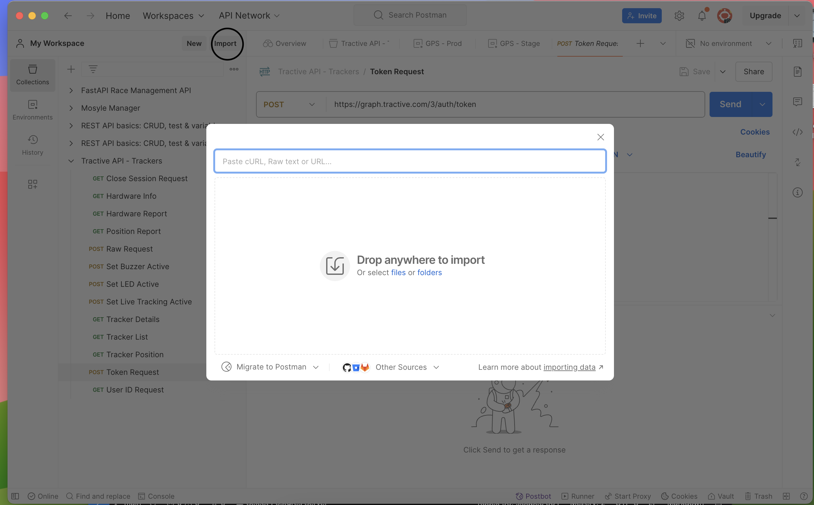
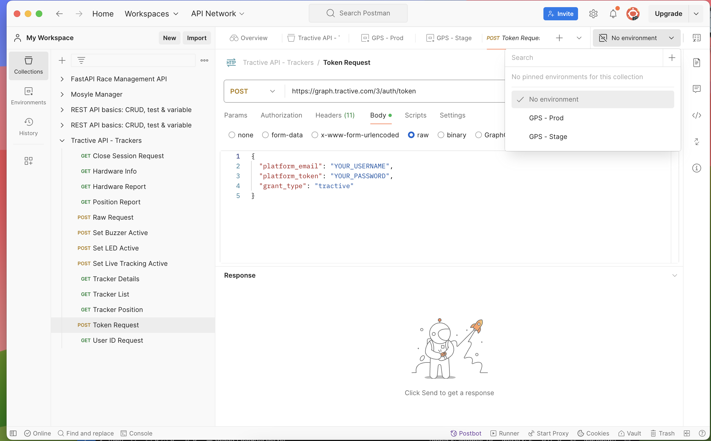

Občas potřebuji sdílet Postmana, abych ti usnadnil práci s příklady API. Možná už to znáš, ale pokud jsi s Postmanem ještě nepracoval, tento článek tě provede základními kroky. Pravděpodobně jsem ti poslal buď ZIP soubor nebo odkaz na GitHub či GitLab, kde najdeš potřebné soubory.

Pokud API vyžaduje autorizaci, často ji nastavuji pomocí pre-scriptu přímo v kolekci. Tento skript se pak automaticky spouští před samotným voláním API a postará se o vypršení tokenu, takže nemusíš řešit ruční aktualizaci.

---

## Stáhni si Postman
První věc, kterou potřebuješ, je samotný **Postman**. Můžeš si ho stáhnout zdarma na oficiálních stránkách [postman.com](https://www.postman.com/downloads/). Stačí kliknout na tlačítko "Download" a následovat instrukce. Postman je dostupný pro Windows, Mac a Linux, takže by neměl být problém nainstalovat ho na tvůj počítač.

## Import souborů do Postmanu
Jakmile máš Postmana nainstalovaného, je čas dostat do něj soubory, které jsem ti poslal. Jestliže jsi obdržel ZIP nebo jiný archivní soubor, nejdřív ho rozbal. Pokud jsem ti poslal odkaz na GitHub nebo GitLab, soubory si stáhni nebo naklonuj.

V Postmanu otevři menu a vyber **File > Import** (nebo jednoduše klikni na tlačítko "Import" v levém horním rohu). Pak buď přetáhni soubory do okna, nebo je nahraj ručně. Postman se postará o to, aby kolekce a prostředí byly správně nahrané a připravené k použití.




## Práce s environmentálními proměnnými
V Postmanu se často používají **environmentální proměnné** – jsou to hodnoty, které se mohou dynamicky měnit podle toho, jaký environment máš zrovna nastavený (například "Development" nebo "Production"). Tyto proměnné ti umožňují rychle přepínat mezi různými nastaveními a udržovat konzistentní data pro různé prostředí.

Pro práci s proměnnými klikni na ikonku oka v pravém horním rohu a vyber příslušný environment, případně si vytvoř nový, pokud žádný není. Do těchto proměnných často zadáš hodnoty jako **URL**, **klíče API** nebo **tokeny pro přihlášení**. Tokeny mohou být klíčové pro autorizaci a obvykle je musíš nastavit pro každé prostředí zvlášť. Při volání API pak použij syntaxi `{{název_proměnné}}` a Postman automaticky dosadí odpovídající hodnotu z environmentální proměnné.



Díky těmto proměnným můžeš snadno spravovat své autorizace a další dynamické hodnoty, aniž bys je musel ručně měnit před každým voláním API.


## Provolání příkazů v Postmanu
Konečně přichází část, kdy voláš samotné API příkazy. V kolekci najdeš jednotlivé endpointy, které jsou připravené k provolání. Jednotlivé příkazy si můžeš rozkliknout a upravit podle potřeby, nebo se můžeš spolehnout na to, že jsou nastavené tak, aby fungovaly bez úprav.

Stačí jen kliknout na **Send** a Postman ti vrátí odpověď. Pokud jsi vše nastavil správně (včetně případných autorizačních údajů), měl bys vidět odpověď přímo v Postmanu.


## Práce s testy v Postmanu
Testování v Postmanu je skvělý způsob, jak automaticky ověřit, zda API vrací očekávané výsledky. U každého požadavku můžeš napsat test, který zkontroluje odpověď. Výsledky testů se ti zobrazí v přehledné tabulce pod odpovědí v záložce **Test Results**. 

### Příklady testů

Zde je několik příkladů testů, které můžeš použít. Každý z nich se zobrazí jako samostatný řádek v tabulce testovacích výsledků.

| Testovací scénář                     | Kód                                                                                  |
|--------------------------------------|--------------------------------------------------------------------------------------|
| **Kontrola status kódu 200**         | ```javascript pm.test("Status code is 200", function () { pm.response.to.have.status(200); }); ``` |
| **Ověření specifického pole**        | ```javascript pm.test("Check name field", function () { var jsonData = pm.response.json(); pm.expect(jsonData.name).to.eql("expected_value"); }); ``` |
| **Test, zda odpověď obsahuje klíč**  | ```javascript pm.test("Response has property 'id'", function () { var jsonData = pm.response.json(); pm.expect(jsonData).to.have.property("id"); }); ``` |
| **Kontrola hodnoty typu data**       | ```javascript pm.test("ID is a number", function () { var jsonData = pm.response.json(); pm.expect(jsonData.id).to.be.a("number"); }); ``` |
| **Ověření času odpovědi**            | ```javascript pm.test("Response time is less than 200ms", function () { pm.expect(pm.response.responseTime).to.be.below(200); }); ``` |

### Jak výsledky vidět v tabulce

Po odeslání požadavku uvidíš v sekci **Test Results** tabulku s názvy testů a jejich výsledky (Passed nebo Failed). Každý testovací blok se zobrazuje jako řádek tabulky s popisem testu a výsledkem, což ti usnadní rychlé ověření, zda API vrací správné výsledky a zda se chová podle očekávání.

Tímto způsobem si můžeš snadno zautomatizovat kontrolu nad API a rychle identifikovat chyby nebo nekonzistence v odpovědích.


## Ukládání informací z API odpovědi do environmentálních proměnných
Při práci s API často potřebuješ použít data z jedné odpovědi pro další požadavek. Postman umožňuje uložit hodnoty do environmentálních proměnných, což ti usnadní práci s dynamickými hodnotami, jako jsou tokeny, ID uživatelů nebo jiné údaje.

1. **Extrahování dat z odpovědi:** Požadované hodnoty můžeš extrahovat z odpovědi pomocí JavaScriptu. Například pokud API vrátí JSON s tokenem, který potřebuješ uložit, můžeš použít následující kód v záložce **Tests**:

    ```javascript
    var jsonData = pm.response.json();
    pm.environment.set("accessToken", jsonData.token);
    ```

    Tento kód uloží hodnotu `token` z odpovědi do environmentální proměnné `accessToken`, kterou pak můžeš použít v dalších požadavcích jako `{{accessToken}}`.

2. **Uložení do globálních proměnných:** Pokud chceš proměnnou sdílet mezi různými environmenty, můžeš použít globální proměnné pomocí `pm.globals.set("variableName", value);`. Většinou je ale lepší používat environmentální proměnné, protože jsou flexibilnější a přehlednější.

3. **Dynamické používání proměnných:** Jakmile máš proměnnou uloženou, můžeš ji použít ve všech požadavcích. Stačí napsat `{{název_proměnné}}` a Postman dosadí odpovídající hodnotu. To ti usnadní práci při testování a při více krocích, kde potřebuješ dynamicky měnit data.

---

## Závěr
Díky těmto krokům máš kompletní sadu návodů pro práci s Postmanem – od importu souborů přes práci s environmentálními proměnnými až po testování a dynamické ukládání dat. Práce s Postmanem je díky těmto možnostem velmi efektivní a umožňuje ti zvládnout i komplexní API požadavky s minimálním úsilím. 
